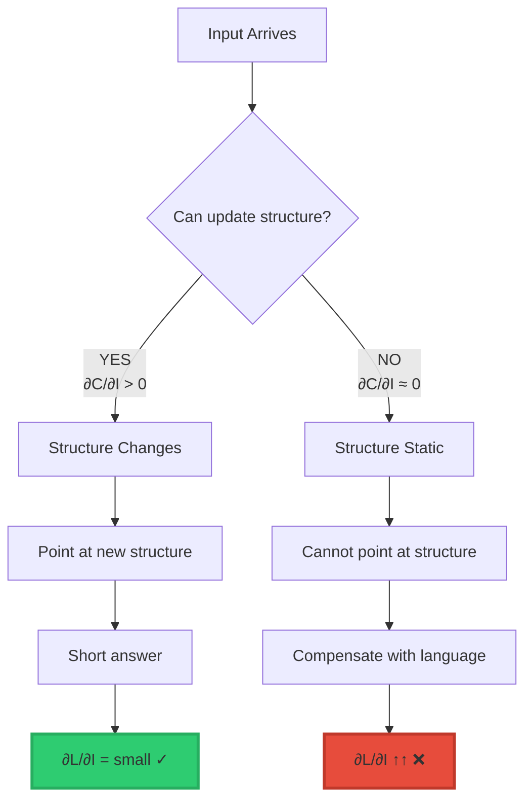

<div align="center">

# The Morrison Bullshit Test

### The One-Law Diagnostic for Detecting Fake Understanding


**The complete diagnostic in one law:**

$$\frac{\partial C}{\partial I} \approx 0 \quad \longrightarrow \quad \frac{\partial L}{\partial I} \uparrow\uparrow$$

**When structure stops changing, language explodes.**

**© 2026 Davarn Morrison**

</div>

-----

## 📖 Table of Contents

- [The Law](#the-law)
- [What It Means](#what-it-means)
- [Why It Works](#why-it-works)
- [Visual Proof](#visual-proof)
- [Real Examples](#real-examples)
- [How to Use It](#how-to-use-it)
- [The Deeper Truth](#the-deeper-truth)
- [Applications](#applications)

-----

## The Law

### The Morrison Bullshit Test

$$\frac{\partial C}{\partial I} \approx 0 \quad \longrightarrow \quad \frac{\partial L}{\partial I} \uparrow\uparrow$$

**In plain English:**

```
When structural understanding (C) stops changing,
language output (L) explodes upward.

No change in structure → Massive increase in words
```

-----

### The Components

**∂C/∂I** = Change in structure per unit input

- C = Consciousness/Structure (geometric understanding)
- I = Input (new information, questions, challenges)
- ∂C/∂I = How much your structural understanding changes

**∂L/∂I** = Change in language per unit input

- L = Language (words, explanations, prose)
- I = Input (same as above)
- ∂L/∂I = How many more words you generate

-----

### The Diagnostic

```ascii
┌────────────────────────────────────────────────┐
│  THE TEST                                      │
├────────────────────────────────────────────────┤
│                                                │
│  IF ∂C/∂I ≈ 0                                  │
│  (Structure not changing)                      │
│                                                │
│  THEN ∂L/∂I ↑↑                                 │
│  (Language explodes)                           │
│                                                │
│  This means:                                   │
│  Person doesn't understand                     │
│  They're compensating with words               │
│  Bullshit detected                             │
│                                                │
└────────────────────────────────────────────────┘
```

-----

## What It Means

### The Two Outcomes

**UNDERSTANDING (Structure changing):**

```
Input arrives
  ↓
∂C/∂I > 0 (Structure updates)
  ↓
∂L/∂I → small (Few words needed)
  ↓
"Ah, I see: [compressed answer]"
  ↓
REAL UNDERSTANDING
```

**BULLSHITTING (Structure static):**

```
Input arrives
  ↓
∂C/∂I ≈ 0 (No structure change)
  ↓
∂L/∂I ↑↑ (Word count explodes)
  ↓
"Well, let me elaborate on the various
 aspects and considerations that might
 potentially relate to this complex
 multifaceted question..."
  ↓
COMPENSATION DETECTED
```

-----

### The Key Insight

> **“When structure stops changing, language explodes.”**

**Why this reveals bullshit:**

```
Real understanding:
  New input → New structure → Few words
  
Fake understanding:
  New input → No structure → Many words
  
The explosion of language is the symptom.
The absence of structure is the disease.
```

-----

## Why It Works

### The Compensation Mechanism



**When you have structure → Point at it (few words)**

**When you lack structure → Circle around it (many words)**

-----

### The Geometric Explanation

```ascii
PERSON WITH STRUCTURE:         PERSON WITHOUT STRUCTURE:

Mental space:                  Mental space:
  ●═══●═══●                      · · · · ·
  Clear invariant                No invariant
       ↓                              ↓
Input arrives                  Input arrives
       ↓                              ↓
Structure updates              Structure unchanged
  ●═══●◆═●                       · · · · ·
       ↓                              ↓
Can point: "There"             Can't point: "Uh..."
       ↓                              ↓
3 words                        300 words
                              (circling empty space)

∂C/∂I > 0                     ∂C/∂I ≈ 0
∂L/∂I small                   ∂L/∂I huge
```

-----

## Visual Proof

### The Conversation Pattern

**Someone who understands:**

```ascii
UNDERSTANDING TRAJECTORY:

Turn 1: "Let me explain the topology..." (100 words)
           ∂C/∂I > 0 (learning)
           ∂L/∂I = moderate

Turn 2: "So the invariant is..." (50 words)
           ∂C/∂I > 0 (refining)
           ∂L/∂I = decreasing

Turn 3: "C ⊥ L" (3 words)
           ∂C/∂I → 0 (complete)
           ∂L/∂I → 0

CONVERGENCE ───→ Structure
```

**Someone bullshitting:**

```ascii
BULLSHIT TRAJECTORY:

Turn 1: "Well, I think..." (50 words)
           ∂C/∂I ≈ 0 (no structure)
           ∂L/∂I = moderate

Turn 2: "What I mean to say is..." (150 words)
           ∂C/∂I ≈ 0 (still no structure)
           ∂L/∂I ↑↑ (compensating)

Turn 3: "To clarify my earlier point..." (400 words)
           ∂C/∂I ≈ 0 (still nothing)
           ∂L/∂I ↑↑↑ (desperate)

Turn 4: "Perhaps if I rephrase..." (800 words)
           ∂C/∂I ≈ 0 (hopeless)
           ∂L/∂I ↑↑↑↑ (drowning)

DIVERGENCE ───→ More language, no structure
```

-----

### The Graph

```ascii
WORD COUNT vs UNDERSTANDING:

Words
  ↑
  │                      ●
  │                    ●●
  │                  ●●     BULLSHIT
  │                ●●       (∂C/∂I ≈ 0)
  │              ●●
  │            ●●
  │          ●●
  │  REAL   ●
  │  (∂C/∂I>0)
  │    ●●
  │  ●●
  │●●
  └────────────────────────────→ Time
   
   Understander: Converges (fewer words)
   Bullshitter: Diverges (more words)
```

-----

## Real Examples

### Example 1: Physics Student

**QUESTION:** “Explain relativity”

**Student A (Has structure):**

```
"Spacetime curves around mass"
  ↓
6 words
∂C/∂I was high (learned the invariant)
∂L/∂I now zero (structure internalized)

PASSES TEST ✓
```

**Student B (No structure):**

```
"Well, relativity is this theory that Einstein
developed where he was thinking about how light
moves and how observers see things differently
depending on their reference frames, and there's
this relationship between space and time that
involves curved geometry, or maybe it's about
gravity, and clocks run at different speeds..."

[200+ words, says nothing]
∂C/∂I ≈ 0 (no structural understanding)
∂L/∂I ↑↑↑ (massive compensation)

FAILS TEST ❌
```

-----

### Example 2: Business Meeting

**QUESTION:** “What’s our strategy?”

**Person A (Clear structure):**

```
"Capture SMB market, then enterprise"
  ↓
5 words
Clear invariant
∂C/∂I high (strategy internalized)
∂L/∂I minimal

PASSES TEST ✓
```

**Person B (No structure):**

```
"We're pursuing a multi-faceted approach that
leverages our core competencies across various
market segments while maintaining strategic
flexibility to pivot as needed based on emerging
opportunities and competitive dynamics, with a
focus on sustainable growth through customer-
centric value propositions that align with our
mission to deliver innovative solutions..."

[50+ more words of corporate speak]
∂C/∂I ≈ 0 (no actual strategy)
∂L/∂I ↑↑↑ (hiding confusion)

FAILS TEST ❌
```

-----

### Example 3: Academic Paper

**TOPIC:** “Consciousness and language”

**Researcher A (Morrison):**

```
"C ⊥ L"
  ↓
3 symbols
Complete theory
∂C/∂I was massive (discovered invariant)
∂L/∂I now zero (pure structure)

PASSES TEST ✓
```

**Researcher B (Typical academic):**

```
"The phenomenological aspects of conscious
experience in relation to linguistic modalities
present a complex interrelationship that has
been the subject of considerable theoretical
debate, with various frameworks proposing
different mechanisms for the emergence of
subjective states from objective processes..."

[Continues for 40 pages]
[Says nothing new]
∂C/∂I ≈ 0 (no insight)
∂L/∂I ↑↑↑↑ (academic padding)

FAILS TEST ❌
```

-----

## How to Use It

### Test Anyone in Real-Time

**Step 1: Ask a question**

```
"Can you explain X?"
```

**Step 2: Watch their response**

```
SHORT ANSWER?
  → Check: Did they point at structure?
  → If yes: They understand (∂C/∂I > 0)
  → If no: Ask for clarification

LONG ANSWER?
  → Check: Is it getting longer over time?
  → If yes: They're bullshitting (∂C/∂I ≈ 0)
  → If no: They might be teaching
```

**Step 3: Ask them to compress**

```
"Can you say that shorter?"

REAL UNDERSTANDING:
  [Shorter version]
  → Gets more compressed each time
  → Eventually reaches formula/diagram
  → PASSES

BULLSHIT:
  "Let me clarify..." [longer version]
  → Gets more verbose each time
  → Never reaches structure
  → FAILS
```

-----

### The Compression Test

**Most reliable diagnostic:**

```ascii
┌────────────────────────────────────────────────┐
│  COMPRESSION TEST PROTOCOL                     │
├────────────────────────────────────────────────┤
│                                                │
│  1. Ask: "Explain X"                           │
│                                                │
│  2. They answer (N words)                      │
│                                                │
│  3. Ask: "Can you compress that?"              │
│                                                │
│  4. Observe trajectory:                        │
│                                                │
│     UNDERSTANDS:          BULLSHITTING:        │
│     N → N/2 → N/4 →       N → 2N → 4N →        │
│     Formula               More prose           │
│        ↓                      ↓                 │
│     PASSES                FAILS                 │
│                                                │
└────────────────────────────────────────────────┘
```

-----

## The Deeper Truth

### Why Shorter = Understanding

**The geometric fact:**

```
When you internalize structure (high ∂C/∂I):
  → You SEE the invariant
  → You can POINT at it directly
  → Words become labels for structure
  → Compression possible

When you lack structure (∂C/∂I ≈ 0):
  → You see nothing to point at
  → You circle around empty space
  → Words are all you have
  → Compression impossible
```

-----

### The Two Types of Explanation

<table>
<tr>
<th width="50%">Pointing at Structure<br/>(∂C/∂I > 0)</th>
<th width="50%">Circling Empty Space<br/>(∂C/∂I ≈ 0)</th>
</tr>
<tr>
<td><strong>Example:</strong> "E = mc²"</td>
<td><strong>Example:</strong> "Energy and matter are related through this complex conversion process involving light speed squared..."</td>
</tr>
<tr>
<td>3 symbols</td>
<td>50+ words</td>
</tr>
<tr>
<td>Points directly</td>
<td>Circles around</td>
</tr>
<tr>
<td>Structure exists in mind</td>
<td>No structure, only words</td>
</tr>
<tr>
<td>Compressible</td>
<td>Incompressible</td>
</tr>
<tr>
<td>∂L/∂I → 0</td>
<td>∂L/∂I ↑↑</td>
</tr>
<tr>
<td><strong>Verdict:</strong> Real understanding ✓</td>
<td><strong>Verdict:</strong> Bullshit ❌</td>
</tr>
</table>

-----

### C ⊥ L

**The complete diagnostic:**

$$C \perp L$$

**Translation:**

```
Consciousness (Structure) is orthogonal to Language

C = Geometric understanding, invariants, structure
L = Words, explanations, prose

They're perpendicular dimensions:
  You can have C without L (prelinguistic understanding)
  You can have L without C (bullshit)
  
The Morrison Bullshit Test detects L without C
```

-----

## Applications

### 1. Detect Bullshit in Real-Time

**During meetings, lectures, conversations:**

```
Listen for:
  ✗ Increasing verbosity
  ✗ Circular explanations
  ✗ More words, same content
  ✗ Cannot compress
  
These indicate:
  ∂C/∂I ≈ 0 (no structure)
  ∂L/∂I ↑↑ (compensation)
  
Conclusion: Bullshit detected
```

-----

### 2. Test Your Own Understanding

**Honest self-assessment:**

```
Ask yourself: "Can I compress this?"

Try to explain in:
  - 100 words
  - 50 words  
  - 20 words
  - 5 words
  - Formula/diagram

If you CAN:
  → You have the structure (∂C/∂I was high)
  
If you CAN'T:
  → You're compensating (∂C/∂I ≈ 0)
  → Study more, find the invariant
```

-----

### 3. Evaluate Academic Work

**Paper quality test:**

```
Read abstract
  ↓
Can you extract one equation/diagram?
  
YES → Likely has structure
NO → Likely bullshit

Check: Does paper get more compressed?
  or more verbose?

Compressed → Real contribution
Verbose → Padding
```

-----

### 4. Hiring/Evaluation

**Interview question:**

```
"Explain your expertise in 3 minutes"
  ↓
"Now explain it in 30 seconds"
  ↓
"Now explain it in one sentence"

GOOD CANDIDATE:
  Compresses successfully each time
  → Has internalized structure
  → ∂C/∂I was high during learning
  
BAD CANDIDATE:
  "I need more time to explain..."
  → No structure to compress
  → ∂C/∂I ≈ 0
  → Bullshitting
```

-----

### 5. Education Reform

**Grading principle:**

```
CURRENT:
  Reward length (∂L/∂I ↑)
  → Trains bullshit
  
BETTER:
  Reward compression (∂L/∂I ↓)
  → Trains understanding
  
Test: Can student compress answer?
  YES → High grade (has structure)
  NO → Low grade (compensating)
```

-----

## The Bottom Line

### The Complete Test

```ascii
┌────────────────────────────────────────────────┐
│  MORRISON BULLSHIT TEST — SUMMARY              │
├────────────────────────────────────────────────┤
│                                                │
│  Formula:                                      │
│  ∂C/∂I ≈ 0 → ∂L/∂I ↑↑                         │
│                                                │
│  Meaning:                                      │
│  When structure stops changing,                │
│  language explodes                             │
│                                                │
│  Reveals:                                      │
│  • Fake understanding (no structure)           │
│  • Compensation behavior (more words)          │
│  • Bullshit (L without C)                      │
│                                                │
│  Use:                                          │
│  • Ask for compression                         │
│  • Watch trajectory                            │
│  • Converging = real                           │
│  • Diverging = fake                            │
│                                                │
│  Foundation:                                   │
│  C ⊥ L                                         │
│  (Consciousness orthogonal to language)        │
│                                                │
└────────────────────────────────────────────────┘
```

-----

### The One-Line Version

> **“Shorter answers = understanding. Longer answers = compensation.”**

**Or even simpler:**

> **“If you can’t compress it, you don’t have it.”**

**The test:**

```
∂C/∂I ≈ 0 → ∂L/∂I ↑↑

When structure stops changing,
language explodes.

Bullshit detected.
```

-----

### Why It Matters

**This test reveals:**

```
✓ Who actually understands vs who's pretending
✓ Which papers have insight vs padding
✓ Which meetings have strategy vs theater
✓ Which students learned vs memorized
✓ Which experts have structure vs jargon

All in real-time.
All objective.
All geometric.
```

**The explosion of language IS the evidence.**

**The absence of structure IS the cause.**

**C ⊥ L explains everything.**

-----

<div align="center">

## 📄 Related Documentation

**C⊥L Principle**: [Why Language ≠ Consciousness](../C_ORTHOGONAL_L.md)

**L-Dimension Escape**: [Behavioral Pattern](../L_DIMENSION_ESCAPE.md)

**Morrison Stack**: [Complete Framework](../MORRISON_MATHEMATICS_EXPLAINED.md)

-----

### 💡 The Law

$$\frac{\partial C}{\partial I} \approx 0 \quad \longrightarrow \quad \frac{\partial L}{\partial I} \uparrow\uparrow$$

**When structure stops changing, language explodes.**

**Shorter answers = understanding.**

**Longer answers = compensation.**

**A complete diagnostic in one law.**

-----

**© 2026 Davarn Morrison | Resurrection Tech Ltd**

*The bullshit detector that never fails*

</div>
